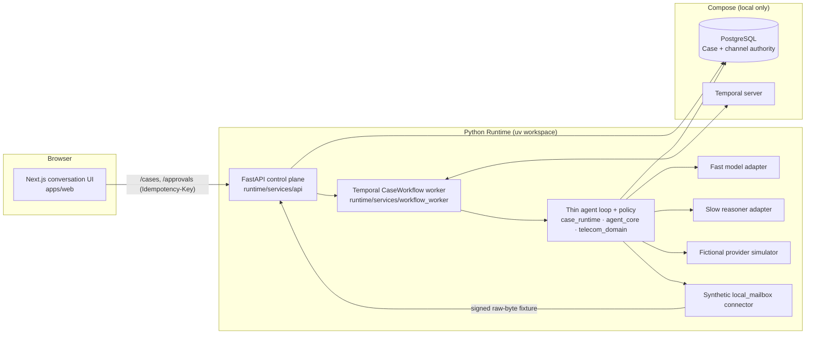

# ProxyLoop

**A durable consumer-negotiation agent that only claims completion when it can prove it.**

ProxyLoop represents a consumer in a bounded task — v1 is lowering a
(fictional) mobile phone bill — by collecting the consumer's goals and limits,
talking to the provider, asking for approval before anything consequential,
executing exactly once, and marking the case complete only from verified
Evidence. Authorization, side effects, and completion live in deterministic
code; language models only propose.

It is a simulator-first portfolio project. Everything runs locally with no
credentials, no real carrier, and no model download. See
[what is and is not implemented](#what-is-implemented) before reading further.

## Quick start

Prerequisites: Docker with Compose, [`uv`](https://docs.astral.sh/uv/),
[`pnpm`](https://pnpm.io/), Python 3.12, Node 22.

```bash
make portfolio-demo
```

This starts PostgreSQL and Temporal in Compose, then the workflow worker, the
FastAPI Runtime, and a production build of the Next.js Web app on loopback
ports, and prints the Web URL plus the two-scene order:

1. **Scene A — Web Case.** Open the Web URL, state the current bill, target
   bill, that the hotspot must stay, and that device financing must not
   change. The Runtime creates one Case, proposes one offer, waits for your
   exact approval, executes once against the fictional provider, and shows a
   receipt only after the Evidence predicate passes. Stop and restart the stack
   and the same Case comes back from PostgreSQL/Temporal.
2. **Scene B — controlled channel.** After `make portfolio-demo-reset` and a
   fresh `make portfolio-demo`, run `make portfolio-demo-channel` in a second
   terminal. It posts a signed synthetic provider e-mail, replays it, and
   proves dedup, one delivery, one callback, two channel Evidence records, and
   that none of it leaks into the browser projection.

`make portfolio-demo-stop` stops everything and keeps data;
`make portfolio-demo-recovery` runs the Temporal lost-response recovery
check. Details, expected output, and troubleshooting are in
[docs/portfolio-demo.md](docs/portfolio-demo.md).

## How it works



The design choices that matter:

- **Models propose, code decides.** A deterministic router splits each turn
  into a *Fast* view (small project-owned model, or the scripted policy) and
  optional *Slow* work (hosted reasoner). Both return typed structures that a
  policy gate checks against current Case state before anything happens.
- **Approvals are version-bound.** An approval pins the exact offer revision;
  a stale or drifted approval is rejected, not silently re-applied.
- **At-most-once execution, evidence-gated completion.** The executor records
  content-addressed Evidence, and the verifier consults the provider's held
  state — a forged confirmation cannot complete a Case.
- **PostgreSQL is business truth; Temporal is orchestration.** The workflow
  orders commands, waits, retries, and recovers, but never owns Case state.
  Revision compare-and-swap protects every write.
- **The browser is a projection.** It stores a locator, the four confirmed
  facts, and one pending command for idempotent retry; it never holds
  channel content or provider references.

Full description: [docs/architecture.md](docs/architecture.md). Domain
vocabulary: [CONTEXT.md](CONTEXT.md).

## What is implemented

| Area | Status |
|---|---|
| Canonical contracts (Pydantic → JSON Schema → TypeScript, drift-checked) | Implemented |
| Fictional provider simulator, 16 scenario families × 2 configs, scripted oracle | Implemented |
| Thin agent Runtime: routing, policy, version-bound approvals, at-most-once execution, Evidence, completion verifier | Implemented |
| OpenAI-compatible Fast/Slow model adapter (explicit opt-in, no key in repo) | Implemented, not part of the demo |
| PostgreSQL Case store with revision CAS; liveness/readiness; redacted operation records | Implemented |
| Temporal `CaseWorkflow` with ordering, retries, and recovery | Implemented |
| Next.js conversation UI with four-fact intake and durable resume | Implemented |
| Synthetic `local_mailbox` channel (signed fixtures, inbox/outbox, dedup, callbacks) | Implemented |
| Multi-turn evaluation harness and untuned hosted baselines | Implemented (research) |
| Post-training of the Fast model | One bounded QLoRA smoke ran and was stopped (`NO_GO`) — see [ML evidence](docs/ml-evidence.md) |
| Real e-mail / MCP / provider integration, voice, auth, deployment | Not started, separately gated |

The Web demo, mailbox, and recovery claims are local observations against the
deterministic simulator; they do not demonstrate production exactly-once
effects or real-provider delivery.

## ML evidence

The Fast model is meant to be a project-trained small model (Qwen3-4B for
the recorded runs; Qwen3-8B for the prepared redo), with a hosted reasoner as
the Slow model.
The evaluation harness, untuned baselines, a hosted reliability rerun, a
six-episode validity diagnostic (0/6 → 5/6 after fixing model/oracle input
parity), and one QLoRA smoke that returned invalid structured output are all
recorded honestly, including costs and what each result does *not* show.
Read [docs/ml-evidence.md](docs/ml-evidence.md).

## Repository layout

```text
apps/web/     Next.js conversation UI
runtime/      Python uv workspace: contracts, simulator, agent core, case runtime,
              connectors, OpenAI adapter, FastAPI service, Temporal worker
ml/           Data pipeline, evaluation, and experiment runners (separate env)
contracts/    Generated JSON Schema and TypeScript artifacts
data/         Versioned manifests, evaluation reports, and redacted samples
docs/         Specification, architecture, decisions, planning, evidence
harness/      Phase contracts, reviews, and execution logs (development governance)
infra/        Placeholders; live infrastructure is the root compose.yaml
tests/        Contract and integration lanes (collected by the runtime project)
voice/        Deferred LiveKit/SIP worker placeholder
```

## Development

```bash
make preflight-fast   # layout, syntax, whitespace — run while iterating
make validate         # format, lint, mypy, tests, contract drift, layout
make preflight        # the full local gate CI runs
make runtime-server   # scripted Runtime only, on 127.0.0.1:8000
```

The complete target list, model-mode configuration, the phase-gated workflow,
and the agent roles used to build this repository are in
[docs/development.md](docs/development.md). The documentation index is
[docs/README.md](docs/README.md); current authorization state is
[harness/status.toml](harness/status.toml).
