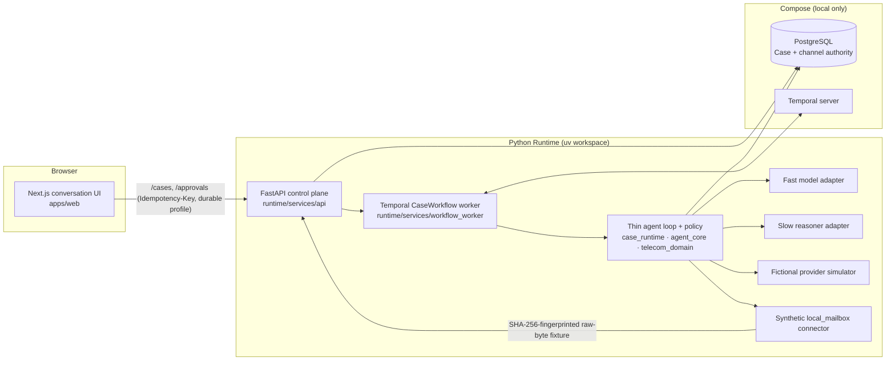

# ProxyLoop

**A durable consumer-negotiation agent that only claims completion when it can prove it.**

ProxyLoop represents a consumer in a bounded task — v1 is lowering a
(fictional) mobile phone bill — by collecting the consumer's goals and limits,
talking to the provider, asking for approval before anything consequential,
executing exactly once, and marking the case complete only from verified
Evidence. Authorization, side effects, and completion live in deterministic
code; language models only propose.

It is a simulator-first portfolio project. Everything runs locally with no
credentials, no real carrier, and no model download. See
[what is and is not implemented](#what-is-implemented) before reading further.

## Quick start

Prerequisites: Docker with Compose, [`uv`](https://docs.astral.sh/uv/),
[`pnpm`](https://pnpm.io/), Python 3.12, Node 22.

```bash
make portfolio-demo
```

This starts PostgreSQL and Temporal in Compose, then the workflow worker, the
FastAPI Runtime, and a production build of the Next.js Web app on loopback
ports (8000 and 3000; `RUNTIME_PORT=` and `WEB_PORT=` override them, and a
taken port fails closed), and prints the Web URL plus the scene order. Each
scene starts from fresh state (`make portfolio-demo-stop`, then
`make portfolio-demo-reset`, then `make portfolio-demo` again):

1. **Scene A — Web Case.** Open the Web URL and describe the bill in one
   message. The card shows what was read and asks only for what was not.
   Creating the Case brings in the fictional offer; Slow proposes it and a
   scripted Judge reviews that proposal (visible only in the Model Traces).
   Your confirmation turn gets one automated assistant line and opens the
   exact approval; the Status Bar follows each step. Approve, and the Runtime
   executes once and shows a receipt only after the Evidence predicate passes.
   Stop and restart the stack and the same Case comes back from
   PostgreSQL/Temporal.
2. **Scene J — scripted journey.** `make portfolio-demo-journey` drives the
   same HTTP routes and checks the whole journey, including an exact approval
   replay that does not execute again and the Model Trace counts.
3. **Scene B — controlled channel.** After `make portfolio-demo-reset` and a
   fresh `make portfolio-demo`, run `make portfolio-demo-channel` in a second
   terminal. It posts a SHA-256-fingerprinted synthetic provider e-mail (unkeyed
   integrity check, not authentication), replays it, and
   proves dedup, one delivery, one callback, two channel Evidence records, and
   that none of it leaks into the browser projection.

`make portfolio-demo-stop` stops everything and keeps data;
`make portfolio-demo-recovery` runs the Temporal lost-response recovery
check. `make ops-report` summarizes the gates and the committed local
measurements offline. Details, expected output, and troubleshooting are in
[docs/portfolio-demo.md](docs/portfolio-demo.md).

## Reproduce the simulator benchmark

This starts no container and needs no credentials and no model. From a
fresh clone, with `uv`, `pnpm`, Python 3.12, Node 22 and the Docker CLI
(`make preflight` runs `docker compose config --quiet`, which only validates
`compose.yaml`):

```bash
git clone https://github.com/SimondXu/ProxyLoop.git && cd ProxyLoop
pnpm install --frozen-lockfile   # the Web checks in make preflight need it
make preflight                   # the full local gate; uv creates both venvs
make benchmark-check             # re-runs the Phase 01B benchmark, byte-compares
make benchmark                   # regenerates data/manifests/phase-01b-*.json
git diff --exit-code             # the regeneration changes no committed byte
```

`make benchmark` prints the report: 16 families × 2 provider configurations,
32 scenarios, 32 valid outcomes, 10 completions, 0 false completions, 0
leakage violations, `gate_passed: true`. That is the scripted oracle's
ceiling on the simulator, not a model result. `make preflight` skips the
tests that need PostgreSQL or Temporal, prints their count per file and
fails if it differs from the pin; those tests run in the three
real-dependency gates ([docs/development.md](docs/development.md)). The
recorded fresh-clone run, with wall times, is in
[the Phase 07 log](harness/log/phase-07-portfolio-hardening.md).

## Observed versus proposed

The 2026-09-21 proposal
([docs/research/2026-09-21-target-architecture-proposal.md](docs/research/2026-09-21-target-architecture-proposal.md))
described a model-driven journey. This is what the demo does today, in the
order the product runs it:

1. **Intake.** One free-text message goes to `POST /intake/proposals`. A
   deterministic, model-free parser (`intake-parser-v1`) reads up to four
   facts into a card; the consumer supplies what it could not read. Nothing
   is stored until "Create fictional Case".
2. **Create.** `POST /cases` creates the Case. Inside that one command the
   fictional Offer arrives, the scripted Slow proposes accepting it (the
   Standing Proposal), and the scripted Judge reviews that proposal.
3. **Confirm.** The consumer's confirmation turn gets one Assistant Message
   through the Disclosure Gate and opens the exact Approval Request.
4. **Approve.** The Runtime executes once against the fictional Provider.
5. **Receipt.** The receipt appears only after the Evidence predicate passes.

The Status Bar follows each step. The Judge is not visible in the Web; it
appears only as a Model Trace.

| Stage | Proposed (2026-09-21) | Observed today |
|---|---|---|
| Intake | Slow reads the free text into a goal proposal | A deterministic parser; no model is called |
| Planning | a hosted frontier Slow | scripted Slow in every gate and in the demo; a hosted Slow exists only in opt-in direct model mode (decision 17) |
| Dialogue | a Fast model speaks every turn under a disclosure gate, against an LLM Provider counterpart | one consumer turn after creation, with one scripted line; the opt-in local distilled model's output was withheld by the gate in every measured call (0/240 product-path rows, 8/8 split-run calls), so the consumer sees the fallback line; the Provider side is the scripted simulator |
| Judge | a model Judge, a second model family where possible, one Slow retry on revise | a scripted Judge that accepts on the default path; the retry runs only in tests |
| Status block | one renderer feeding both model prompts | a Web-only Status Bar built from the browser projection; it is not a model prompt |
| Approval | exact pins, approve and reject | exact pins and expiry; approve only, no reject control |
| Execution and completion | at-most-once with a persisted claim, completion verified against Provider state, a receipt; `ActionIntent` naming a capability; an execution-claim Evidence type | the approval ledger, persisted claim, state-verified completion and receipt are built, against the fictional Provider only; the two contract changes are not (the capability/action join is checked at Slow admission instead, A-3; A-5 is a recorded limit) |
| Evaluation | a Fast/Slow condition matrix and V0 (frontier in both slots) before any training | V0 not measured (no budget); training ran first (Phase 03C); per-turn Fast/Slow split reports for the scripted, distilled and untuned backends |
| Channels, voice, memory | deferred | still not built; the mailbox is synthetic |

## What is not done

Not done, and not claimed: production serving, load, p95, capacity,
concurrency, OOM or automatic fallback for the distilled adapter, and
production exactly-once effects, monitoring or readiness; deployment, hosting and
release; Phase 06B2 and every real channel (real Providers, Gmail and OAuth,
e-mail, MCP, SMS, voice) and every credential; V0, frontier-as-Fast and a
second-family Judge (not measured, budget); a model Judge and any Judge
verdict distribution; further training, data expansion, reruns or
promotion; narrow contracts 1.2 (PR-15, dropped by decision 21); the
build-plan "Do not do" items; a Web free-text turn after creation, Web views
of channels or the Judge, and any UI redesign; hosted spend of any kind in
Phase 07 (no budget is recorded).
Every limit, negative result, and the cost record are in
[docs/limitations.md](docs/limitations.md).

## How it works



The design choices that matter:

- **Models propose, code decides.** A deterministic router splits each turn
  into a *Fast* view (small project-owned model, or the scripted policy) and
  optional *Slow* work (hosted reasoner). Both return typed structures that a
  policy gate checks against current Case state before anything happens.
- **Approvals are version-bound.** An approval pins the exact offer revision;
  a stale or drifted approval is rejected, not silently re-applied.
- **Approval-bound execution, evidence-gated completion.** Each approval
  executes at most once per Runtime process (executor ledger) and a
  persisted execution claim lets an interrupted command finish rather than
  re-execute in the durable profile; the fictional Provider's own state
  machine is the last line. The executor records content-addressed Evidence,
  and the verifier consults the provider's held state for accepted offers —
  a forged confirmation cannot complete a Case.
- **PostgreSQL is business truth; Temporal is orchestration.** The workflow
  orders commands, waits, retries, and recovers, but never owns Case state.
  Revision compare-and-swap protects every write.
- **The browser is a projection.** It stores a locator, the four confirmed
  facts, and one pending command for idempotent retry; it never holds
  channel content or provider references.

Full description: [docs/architecture.md](docs/architecture.md). Domain
vocabulary: [CONTEXT.md](CONTEXT.md).

## What is implemented

| Area | Status |
|---|---|
| Canonical contracts (Pydantic → JSON Schema → TypeScript, drift-checked) | Implemented |
| Fictional provider simulator, 16 scenario families × 2 configs, scripted oracle | Implemented |
| Thin agent Runtime: routing, policy, version-bound approvals, at-most-once execution, Evidence, completion verifier | Implemented |
| OpenAI-compatible Fast/Slow model adapter (explicit opt-in, no key in repo) | Implemented, not part of the demo |
| PostgreSQL Case store with revision CAS; liveness/readiness; redacted operation records | Implemented |
| Temporal `CaseWorkflow` with ordering, retries, and recovery | Implemented |
| Next.js conversation UI with four-fact intake and durable resume | Implemented |
| Synthetic `local_mailbox` channel (SHA-256-fingerprinted fixtures, inbox/outbox, dedup, callbacks) | Implemented |
| Multi-turn evaluation harness and untuned hosted baselines | Implemented (research) |
| Post-training of the Fast model | Phase 03C distillation ran and reached `GO_DISTILLED` on the trained prompt path (0.542 → 0.983 on held-out families); the earlier QLoRA smoke was stopped (`NO_GO`). Served only as a local opt-in candidate, never promoted; through the product path it delivers **0/240** lines — see [ML evidence](docs/ml-evidence.md) |
| Real e-mail / MCP / provider integration, voice, auth, deployment | Not started, separately gated |

The Web demo, mailbox, and recovery claims are local observations against the
deterministic simulator; they do not demonstrate production exactly-once
effects or real-provider delivery.

## ML evidence

The Fast model is meant to be a project-trained small model (Qwen3-8B), with
a hosted reasoner as the Slow model. Phase 03C trained one; nothing has been
promoted. The Runtime's default Fast and Slow are scripted; the trained
adapter can be served locally as an opt-in Fast backend, labelled a local
opt-in candidate.

Phase 03C distilled it from an oracle-filtered teacher set: 8,003
`claude-sonnet-5` samples, 807 quarantined (499 for disagreeing with the
scripted oracle), **7,196 accepted**; LoRA on 1.055 % of the parameters for
6.6 h on one A100. On 240 held-out rows from six scenario families that
appear in no training row, act agreement goes from **0.542 untuned to 0.983
distilled** — decision `GO_DISTILLED`, every raw output re-scored locally
against the repository evaluator with zero disagreements. No policy violation
fires on that set, but the set contains no disclosure-risk row, so that zero
is partly untested: on the in-family dev rows the distilled model still names
a restricted field 4 times in 400 (the untuned model, 7). Sources:
`data/experiments/phase-03c/training/cloud-run-01/eval/heldout-rescored.json`
and `dev-rescored.json` beside it.

The write-up states what that does *not* show: the 240 rows carry only six
distinct decision rules, the gain is one repaired defect (the untuned model
almost never said `confirm`), the constrained-decoding arms were handicapped
by a token cap, and nothing has been promoted to serving.

**Through the product path the result is negative.** Rendered the way the
Runtime renders a turn and replayed through its delivery rules, the same
240 rows give **0/240** delivered distilled lines (40 refused before the
model because the family has no offer; the Disclosure Gate withholds all
200 others) and act agreement **0.654**. The drop splits about evenly
between the no-offer refusals and a missing input field (`applied_changes`,
D4). About a third of the distilled calls ran over the 25 s timeout on one
Apple M4 Pro. The untuned baseline delivers 8/240. A consumer on the local
distilled backend sees the fixed fallback line. Sources:
`data/experiments/phase-03c/local-parity/product-path-report.json`; the
latency figure is in `harness/log/feat-pr9b-local-fast-gateway.md`.

Earlier runs — the
evaluation harness, untuned baselines, a hosted reliability rerun, a
six-episode validity diagnostic (0/6 → 5/6 after giving the model the
oracle's inputs and its decision rules) and the Phase 03B QLoRA smoke that
returned invalid structured output — are recorded with the same honesty.
Read [docs/ml-evidence.md](docs/ml-evidence.md); costs are in
[docs/limitations.md](docs/limitations.md#cost).

## Repository layout

```text
apps/web/     Next.js conversation UI
runtime/      Python uv workspace: contracts, simulator, agent core, case runtime,
              connectors, OpenAI adapter, FastAPI service, Temporal worker
ml/           Data pipeline, evaluation, and experiment runners (separate env)
contracts/    Generated JSON Schema and TypeScript artifacts
data/         Versioned manifests, evaluation reports, and redacted samples
docs/         Specification, architecture, decisions, planning, evidence
harness/      Phase contracts, reviews, and execution logs (development governance)
infra/        Placeholders; live infrastructure is the root compose.yaml
tests/        Contract and integration lanes (collected by the runtime project)
voice/        Deferred LiveKit/SIP worker placeholder
```

## Development

```bash
pnpm install --frozen-lockfile   # once per clone or worktree, before validate/preflight
make preflight-fast   # layout, syntax, whitespace — run while iterating
make validate         # format, lint, mypy, tests, contract drift, layout
make preflight        # the full local gate CI runs
make runtime-server   # scripted Runtime only, on 127.0.0.1:8000
```

The complete target list, model-mode configuration, the phase-gated workflow,
and the agent roles used to build this repository are in
[docs/development.md](docs/development.md). The documentation index is
[docs/README.md](docs/README.md); current authorization state is
[harness/status.toml](harness/status.toml).
