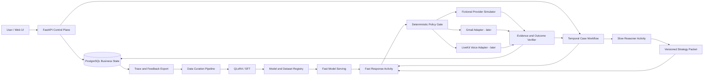

# Architecture Overview

## Purpose

The system represents a consumer in a narrowly scoped telecom bill-optimization case. It collects the consumer's goals and constraints, plans a negotiation, conducts low-latency dialogue against a provider, records evidence, requests approval for consequential actions, and continues until the case reaches a verifiable terminal state.

The architecture must serve two related but separate concerns:

1. A reproducible ML system for data generation, post-training, evaluation, serving, and failure-driven retraining.
2. A durable agent product that can later wait across days, receive external events, use controlled channels, and recover without duplicating side effects.

The system is a portfolio-grade prototype until it has completed a real, reviewed pilot. It is not described as a production Pine clone.

## High-Level Shape



The research MVP bypasses Temporal, Gmail, and LiveKit. It runs `Fast/Slow consumer agent -> provider simulator -> verifier` synchronously so the ML hypothesis can be tested before product infrastructure is added.

## Architectural Layers

### Experience Layer

- `apps/web`: Next.js user interface for case creation, constraint review, approvals, timeline, offer comparison, and evidence receipt.
- The UI never communicates directly with model providers, Gmail, SIP carriers, or the simulator.

### Control Plane

- `runtime/services/api`: FastAPI endpoints, authentication boundary, webhook ingress, case queries, and approval commands.
- Validates all external input against versioned contracts before persisting or signaling workflows.
- Does not execute long-running model or channel work inside HTTP requests.

### Durable Orchestration

- `runtime/services/workflow_worker`: Temporal workflows and activities.
- Workflow responsibility: case phase, timers, signals, retries, approval waits, cancellation, and continue-as-new policy.
- Activity responsibility: model calls, Postgres operations, email operations, provider simulation, and telephony.
- Temporal history is not the authoritative business database.

### Agent Intelligence

- `runtime/services/model_gateway`: provider-neutral interface to the hosted Slow Reasoner and served Fast Model.
- `runtime/packages/agent_core`: Safe Observation Adapter, routing rules, policy gates, strategy validation, fact updates, and completion-candidate validation.
- PydanticAI may implement typed hosted-model calls, but it does not own workflow durability, authorization, or business state.

### Provider and Channel Layer

- `runtime/packages/provider_simulator`: fictional telecom provider, plan catalog, account/bill state, retention policy, provider personas, and deterministic mutations.
- `runtime/packages/connectors`: email and other asynchronous channel adapters added after the ML MVP.
- `voice/worker`: LiveKit agent and SIP integration added only after text-policy gates pass.
- Channel adapters translate events; they do not decide negotiation strategy or case completion.

### ML and Data Layer

- `ml/data_pipeline`: ingestion, normalization, synthetic rollout generation, quality filters, lineage, leakage detection, and split manifests.
- `ml/training`: base-model experiments, QLoRA/SFT, loss configuration, checkpoints, and reproducibility metadata.
- `ml/evaluation`: policy-field, end-to-end, safety, cost, latency, and statistical evaluation.
- `ml/serving`: vLLM deployment configuration for the promoted Linux/CUDA path. Apple-local serving remains a development adapter behind the same gateway contract.
- Large datasets, audio, and checkpoints live in object storage; Git stores schemas, manifests, small fixtures, and reports.

Phase 02 implements the first narrow Data Factory seam as a separate CPU-only `ml/` project. It consumes Phase 01B Safe Observation and Provider-environment interfaces through local path dependencies, exports only small drift-checked metadata artifacts, and cannot be imported by runtime packages or services. Its initial 128-record one-turn scripted pilot validates reproducibility and curation gates; it is explicitly not a training-ready corpus or a learned-model result.

## Model Responsibilities

### Slow Reasoner

The initial Slow Reasoner is OpenAI `gpt-5.6-terra`, called through a provider-neutral adapter with structured outputs and medium reasoning effort as the starting configuration. It runs at case initialization and on explicit triggers such as a changed user constraint, provider refusal, stalled negotiation, high-risk candidate completion, or invalid/expired strategy.

It returns a `StrategyPacket` containing:

- `strategy_id`, `version`, `created_at`, and `expires_at`;
- `case_version` and `fact_ledger_version`;
- primary objective and current subgoal;
- hard constraints and ranked preferences;
- allowed and approval-required disclosure fields;
- concession ladder and fallback outcomes;
- required completion evidence;
- escalation and replan conditions.

Raw chain-of-thought is neither requested nor persisted.

### Fast Response Model

The Fast Response Model is the only model trained by the project. The initial checkpoint is `Qwen/Qwen3-4B-Instruct-2507`, used in its native non-thinking mode. It receives a safe, bounded view:

- consumer brief;
- current valid `StrategyPacket`;
- verified fact ledger snapshot;
- recent provider-visible conversation;
- latest provider message;
- allowed dialogue acts and disclosure policy.

It returns a `FastTurnDecision`:

```json
{
  "dialogue_act": "clarify|counter|confirm|challenge|escalate|close",
  "fact_updates": [
    {
      "key": "monthly_price",
      "value": 79,
      "source_message_id": "m_123",
      "confidence": 0.99,
      "status": "candidate"
    }
  ],
  "reasoner_request": {
    "needed": false,
    "reason_code": "none"
  },
  "completion_claim": {
    "status": "not_done|candidate",
    "evidence_message_ids": []
  },
  "response_text": "..."
}
```

The Fast Model cannot:

- read provider-internal policy, database state, reference actions, or evaluation criteria;
- mark a fact as externally verified without evidence;
- declare final completion;
- accept a contract, disclose protected information, send email, or place a call directly;
- hold channel credentials.

## Core Domain Contracts

The first implementation should define these Pydantic contracts before service code:

- `Case`: lifecycle identity, owner, phase, version, and timestamps.
- `ConsumerGoal`: desired outcome, budget, service requirements, and deadline.
- `Constraint`: hard/soft classification, source, version, and validity.
- `BillSnapshot`: current price, line items, add-ons, term, usage, and evidence source.
- `FactLedger`: append-only candidate/verified/rejected facts with provenance.
- `StrategyPacket`: Slow Reasoner output described above.
- `FastTurnDecision`: Fast Model output described above.
- `ProviderOffer`: monthly price, total cost, features, fees, term, expiry, and provider evidence.
- `ActionIntent`: proposed external or simulator action.
- `ApprovalRequest`: exact action/offer version and expiry that the user approves or rejects.
- `Evidence`: message, provider event, confirmation ID, bill, or simulator state transition.
- `CompletionDecision`: deterministic verifier result and missing evidence.
- `ModelTrace`: model/data/prompt versions, latency, token usage, result, and safety flags.

All mutable objects use optimistic versions. An approval is valid only for the exact case, strategy, constraint set, and offer version it references.

## State Ownership

| State | Authoritative owner | Notes |
|---|---|---|
| Cases, constraints, offers, approvals, evidence, fact ledger | PostgreSQL | Business source of truth and audit surface. |
| Timers, retries, waits, workflow phase | Temporal | Stores IDs and control state, not a second business database. |
| Provider simulator episode | Simulator store | Resettable and versioned per benchmark episode. |
| Raw/curated datasets, audio, checkpoints | Object storage | Addressed by immutable manifest and content hash. |
| Experiment runs and promoted model metadata | MLflow OSS | SQLite/local artifacts for the first experiments; database-backed registry and S3-compatible artifacts for integrated deployment. |
| Prompt context | Ephemeral model request | Reconstructed from approved business state; never authoritative. |

## Core Runtime Flow

1. User submits a bill snapshot, goals, constraints, allowed disclosures, and contact preferences.
2. API validates and persists a new versioned case.
3. Workflow requests a Slow `StrategyPacket` through an activity.
4. Policy validation rejects a packet that references unavailable facts, forbidden actions, or stale case versions.
5. Fast Model receives a safe observation and proposes a turn.
6. Deterministic gate validates the act, disclosures, fact updates, and requested action.
7. Simulator or later channel adapter executes the approved side effect with an idempotency key.
8. Response and evidence update PostgreSQL and signal the workflow.
9. Verifier decides `continue`, `needs_user`, `needs_replan`, `candidate_complete`, or `complete`.
10. Completion requires the final plan/credit, price, effective date, term/expiry, fees, feature changes, and confirmation evidence.

## Data and Training Flow

1. Freeze scenario families, entity clusters, provider policy branches, and headline test manifests before teacher generation.
2. Ingest only sources with recorded provenance and license status.
3. Normalize records into a versioned trajectory schema.
4. Generate consumer strategies and rollouts with at least two teacher/provider model families where budget permits.
5. Execute every trajectory in the simulator.
6. Filter with deterministic state checks, safety rules, schema validation, and random human review.
7. Quarantine rejected samples with reason codes instead of deleting evidence.
8. Train the Fast Model on policy fields plus response text, with loss masking/weighting measured explicitly.
9. Evaluate on family/entity/provider-held-out cases, multiple seeds, and paired baselines.
10. Promote a model only after policy, safety, serving, and regression gates pass.

The Phase 02 pilot stops after step 7. Its deterministic scripted consumer substitutes for a paid teacher only to verify the Data Factory interface and records zero external token cost; teacher-backed expansion and every training/evaluation step remain separately gated.

## Safety and Reliability Invariants

- External text and speech are untrusted inputs and may contain prompt injection.
- Model output never bypasses deterministic authorization and disclosure gates.
- Side-effecting activities require an outbox record, provider event ID when available, and an idempotency key.
- Temporal retries must not create duplicate emails, calls, approvals, plan changes, or credits.
- A stale strategy or approval cannot authorize a changed offer.
- Fast Model completion is always a candidate; the external verifier has final authority.
- Production feedback enters a quarantine/review queue and never flows directly into training.
- PII is excluded from training data unless a separately documented consent and retention policy permits it.
- Every trace links `case -> prompt/model -> evidence -> dataset derivation -> model version` where applicable.

## Observability

Every model/channel/workflow span should carry:

- `case_id`, `workflow_id`, and `episode_id`;
- case/strategy/fact-ledger versions;
- model, adapter, prompt, dataset, and simulator versions;
- latency segments, token usage, and estimated cost;
- policy-gate result and reason code;
- provider/channel result and idempotency key;
- verifier outcome and safety flags.

Dashboards should separate model quality from infrastructure reliability:

- task/constraint success and false completion;
- fact precision/recall and unsupported verified facts;
- Slow call rate and value added;
- latency/cost per successful case;
- workflow retries, duplicate-side-effect prevention, and stuck cases;
- provider refusal, transfer, and channel failure rates.

## Deployment Shape

### Research MVP

- Local/CI simulator process;
- Fast and Slow adapters;
- optional remote GPU Fast inference;
- object storage or local artifact directory;
- experiment tracker;
- no Temporal, Gmail, or telephony.

### Integrated Portfolio Demo

- Next.js web app;
- FastAPI control plane;
- PostgreSQL;
- Temporal server and Python worker;
- Fast Model inference endpoint;
- hosted Slow Reasoner;
- Gmail draft/controlled test mailbox;
- optional LiveKit worker and owned test number;
- OpenTelemetry-compatible traces and metrics.

## Extension Points

- New providers implement a versioned provider-policy and plan-catalog adapter.
- New product domains implement domain contracts, simulator transitions, completion verifier, and benchmark families without changing workflow fundamentals.
- A future Agentic RL stage consumes verified simulator rewards only after SFT and evaluation stability; it is not part of the initial architecture claim.
