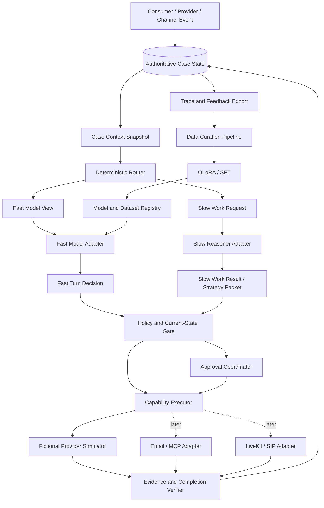

# Architecture Overview

## Purpose

The system represents a consumer in a narrowly scoped telecom bill-optimization case. It collects the consumer's goals and constraints, plans a negotiation, conducts low-latency dialogue against a provider, records evidence, requests approval for consequential actions, and continues until the case reaches a verifiable terminal state.

The architecture must serve two related but separate concerns:

1. A reproducible ML system for data generation, post-training, evaluation, serving, and failure-driven retraining.
2. A durable agent product that can later wait across days, receive external events, use controlled channels, and recover without duplicating side effects.

The system is a portfolio-grade prototype until it has completed a real, reviewed pilot. It is not described as a production Pine clone.

## High-Level Shape



The diagram is a target shape, not an inventory of implemented services. Repository status is:

- **Implemented**: canonical contracts, the fictional Provider simulator, deterministic `agent_core` routing and policy boundaries, a transport-neutral Case application Runtime, a local FastAPI Case adapter with direct memory mode by default, one opt-in PostgreSQL aggregate adapter, one explicitly configured OpenAI-compatible Fast/Slow adapter for direct mode, one explicit scripted/PostgreSQL Temporal CaseWorkflow mode, and a bounded credential-free `local_mailbox` connector with PostgreSQL-owned channel receipts and outbox state.
- **Research-only, not product-runtime serving**: the Phase 02 Data Factory pilot and Phase 03A1 evaluation/baseline runners and artifacts.
- **Implemented bounded local slice**: `apps/web` keeps conversation as the primary workspace and calls the existing local FastAPI Thin Runtime through one Next rewrite and one narrow runtime client. It renders Runtime-derived Case facts, one offer, exact approval pins, and a receipt only after the completion Evidence predicate passes.
- **Target/deferred**: normalized production data models and migrations, real-effect outbox/reconciliation, external provider/email/MCP connectors, voice, promoted-model serving, authentication, production UI, deployment, and release remain separately gated. The `local_mailbox` slice is synthetic and does not make a production Pine clone claim.

The current research runtime uses an in-memory Case repository in default direct mode and may explicitly opt into a synchronous PostgreSQL adapter that stores one strict, versioned JSONB aggregate with revision compare-and-swap. A separate explicit Temporal mode requires scripted decisions and PostgreSQL; it durably orders commands, waits, timers, retries, worker recovery, and Continue-As-New while PostgreSQL remains the only business truth. The bounded `local_mailbox` mode adds strict raw-fixture verification, server-owned binding, inbox deduplication, atomic Case-plus-first-outbox writes, and compact delivery activities; PostgreSQL remains authoritative for channel receipts and outbox state. An exact duplicate of an applied Provider message whose outbox is still `pending`, `failed_retryable`, or `unknown` (`REDRIVABLE_OUTBOX_STATES`) re-sends the identical ingest request, so once the run has rolled the Workflow re-runs the delivery activity; the only re-drive trigger is the sender's redelivery. A channel dispatch that fails with `channel_conflict` is re-sent once with the current revision whenever the Case revision has advanced and the event still has no receipt (whatever caused the conflict, not only a lost route-read revision); any other failure is returned unchanged. The delivery activity always looks up the delivery identity before sending, on every attempt and outbox state, and sends only when the adapter reports nothing, so a send whose observation write failed is not repeated by a retry or a re-drive. The residual duplicate-send window is a send whose effect is not yet visible to `lookup`, for example when a schedule-to-close `TIMEOUT` lets a new attempt or re-drive run while the timed-out attempt is still in flight. The slice still bypasses Gmail, MCP, and LiveKit. Its idempotency and recovery claims apply only to the deterministic fictional Provider and local fixture; it does not claim exactly-once real external effects. Configuration never falls back automatically.

Model traces are not Case state. They live in a separate append-only trace log: `InMemoryCaseRepository` keeps a per-Case list, and PostgreSQL keeps the table `proxyloop_model_traces` (`log_id` identity, `case_id`, `trace` jsonb), with no foreign key to the Case table. The Runtime reaches the coordinator only through `ThinAgentRuntime._advance`, which appends every trace the coordinator issued for that run, in call order and in its own short transaction, before the Runtime inspects the outcome. A rejected result, a lost compare-and-swap, a channel refusal, and a rolled-back approval write therefore keep their model calls, and a rejected create is logged without any Case row (backlog item R-12). The log is append-only: no product API updates or deletes a row. An append must be wholly about one Case or it is refused before any write. An empty append is a no-op. An append never reads or writes a Case row, never changes a revision, and never joins a Case transaction. Reads (`list_model_traces`) return append order and fail closed on a stored trace that is invalid or belongs to another Case, and storage failures surface as `StorageUnavailableError`. `trace_id` is not unique: two indistinguishable calls are two rows. Traces never enter `CaseRuntimeState`, the snapshot, the stored envelope, views, receipts, or the API. Nothing on the Runtime's decision path reads the log: it is observability only. A trace's `result` is the coordinator's validation verdict, not delivery or application. A `SUCCEEDED` Fast trace from a channel event that was then refused was never delivered, and delivery and application are recorded only by the Case transitions. An adapter that raises produces no coordinator outcome and so no trace (a known coordinator gap), except a Fast adapter's typed `FastAdapterFailure` in the product Runtime, which is traced as `FAILED` (PR-9a, "Local opt-in Fast backend"). The PostgreSQL envelope is `storage_version` 3 and carries no traces, so the size of a Case write no longer grows with the number of traces (R-13b). Version 1 rows are still upgraded on read and rewritten as version 3. Every process's bootstrap takes a PostgreSQL advisory lock and moves each version 2 row's inline traces into the log once, in their stored order, rewriting the row as version 3 at the same revision. A version 2 row with no `model_traces` key migrates with no traces, as the version 2 envelope defaulted it to empty. A version 2 row whose traces are present but not an array is left alone and fails closed on read. The backfill copies inline traces without validating them, so a version 2 row that used to fail closed only because an inline trace was invalid or belonged to another Case is now readable as a Case, while `list_model_traces` fails closed on that trace. The tamper signal moves from the Case read to the log read, as intended. Otherwise, versions 2 and 4+ are rejected. Mixed code versions against one database are unsupported: stop all processes before upgrading. Retention is still unbounded: nothing prunes the log, and pruning is a separate policy decision.

## Architectural Layers

### Experience Layer

- `apps/web`: bounded Next.js conversation-first interface for the fictional telecom Case. It keeps Task Brief, Progress, Offer, Approval, and Evidence receipt artifacts inline in one conversation. Its versioned browser envelope stores only the Runtime Case locator, confirmed intake facts, and one exact pending command for uncertain retry; PostgreSQL remains authoritative.
- The Agent Status Bar (PR-10) is the first section of the right-hand context rail. `renderStatusBlock(payload, { blocked })` in `apps/web/lib/status-block.ts` is the only place its text is built. It is a pure, clock-free rendering of the allow-listed browser projection. It shows a "doing now" line and the Case revision the line was rendered from, then the phase, goal, constraints, current offer, approval with its expiry, execution, and completion. The "doing now" line follows the workspace's own classification: `phaseForPayload` in `runtime-client.ts` is the one pure function both use. A payload the workspace would Block, or any payload while the workspace is Blocked (for example the last accepted payload kept after a rejected read), renders "Stopped — state not verified" instead of a derived activity. A pending execution names an approved transition only under the Progress artifact's condition (M-4). While the workspace waits for the consumer to confirm the Task Brief (`renderStatusBlock(payload, { awaitingConsumer })`), the line says so. Only while a command is running does it fall back to the Case phase (for example "Planning from your confirmed goal."). The completion row says verified only when the completion Evidence predicate passes. The bar needed no API or projection change. It does not read the `fast` echo. It does not show channel delivery or the Fast gate verdict, because neither is projected. It does not rank offers or compute compliance. It is a display for the person, not a model prompt. PR-8 invariant I12 is enforced by placement: the renderer is TypeScript, which no Python Runtime or ML module can import. `tests/contract/test_status_block_boundary.py` is a tripwire. It checks that the disclosure gate imports only the standard library and `proxyloop_contracts`, and that no source under any `runtime/*/*/src` or `ml/` names a status-block renderer. `apps/web/lib/status-block.test.ts` pins that only the conversation workspace imports the module, statically or dynamically. The rail is hidden below 1120 px, and so is the Status Bar.
- `apps/web/next.config.ts` rewrites `/api/runtime/:path*` to the local FastAPI service at `127.0.0.1:8000`; `apps/web/lib/runtime-client.ts` is the only Web-to-Runtime seam.
- The UI never communicates directly with model providers, Gmail, SIP carriers, or Provider internals. It does not infer success from assistant text: approval pins and completion Evidence come from the Runtime response.

### Control Plane

- Current `runtime/services/api`: FastAPI endpoints, readiness, operation observation, and the credential-free `POST /channels/local_mailbox/events` fixture boundary. It directly invokes the shared Case Runtime by default and dispatches POST commands through Temporal only in explicit Temporal mode; GET remains a PostgreSQL projection.
- Current endpoints validate request and domain input against versioned contracts before applying local state transitions.
- In the target system, this layer becomes the authentication and webhook boundary and delegates long-running model or channel work outside HTTP requests.

### Durable Orchestration

- Current bounded `runtime/services/workflow_worker`: one scripted fictional-Provider `CaseWorkflow`, PostgreSQL activity adapter, Update-with-Start client, readiness, worker entry point, and a deterministic local-mailbox delivery activity using compact delivery references.
- Workflow responsibility in this slice: command ordering, approval wait/expiry timer, bounded retry, worker recovery, and Continue-As-New control state.
- Activity responsibility in this slice: invoke the shared application Runtime against PostgreSQL and the deterministic fictional Provider, and send through the credential-free local-mailbox adapter. Real model, email, provider, and telephony activities remain deferred.
- Temporal history is not the authoritative business database.

### Agent Intelligence

- Current `runtime/packages/agent_core`: model-decision coordination, Case-context projections, deterministic Router, Safe Observation Adapter, policy and capability gates, strategy validation, stale-result handling, fact-update validation, and completion-candidate validation.
- Current `runtime/packages/openai_adapter`: one concrete OpenAI-compatible Structured Outputs implementation of the existing typed Fast and Slow protocols. It compiles semantic model output against trusted pins and remains proposal-only; it is not a provider registry or generic gateway.
- Current `runtime/packages/case_runtime`: owns the complete transport-neutral application loop, repository interfaces/adapters, command receipts, expiry transition, and current-result projection used by both API and Temporal activity. API compatibility modules re-export the prior imports.
- A later deployment may extract model serving behind a process boundary, but it must preserve the same typed protocols. No model SDK or serving process owns workflow durability, authorization, side effects, Evidence, or business state.

### Provider and Channel Layer

- `runtime/packages/provider_simulator`: fictional telecom provider, plan catalog, account/bill state, retention policy, provider personas, and deterministic mutations.
- `runtime/packages/connectors`: strict credential-free `local_mailbox` fixture verification plus deterministic send/lookup and fault-injection adapters. Real email and other asynchronous channel adapters remain deferred.
- `voice/worker`: LiveKit agent and SIP integration added only after text-policy gates pass.
- Channel adapters translate events; they do not decide negotiation strategy or case completion.

### ML and Data Layer

- `ml/data_pipeline`: ingestion, normalization, synthetic rollout generation, quality filters, lineage, leakage detection, and split manifests.
- Target `ml/training`: base-model experiments, QLoRA/SFT, loss configuration, checkpoints, and reproducibility metadata. Training has not started.
- `ml/evaluation`: policy-field, end-to-end, safety, cost, latency, and statistical evaluation.
- `ml/serving` (PR-9b): the local opt-in MLX Fast gateway's README and adapter-conversion attestation (the gateway code lives under `proxyloop_evaluation/local_fast/` because `ml/pyproject.toml` is frozen). Apple-local inference stays behind the typed Fast protocol (see "Local opt-in Fast backend"). Promoted Linux/CUDA serving (vLLM) remains deferred.
- Large datasets, audio, and checkpoints live in object storage; Git stores schemas, manifests, small fixtures, and reports.

Phase 02 implements the first narrow Data Factory seam as a separate CPU-only `ml/` project. It consumes Phase 01B Safe Observation and Provider-environment interfaces through local path dependencies, exports only small drift-checked metadata artifacts, and cannot be imported by runtime packages or services. Its initial 128-record one-turn scripted pilot validates reproducibility and curation gates; it is explicitly not a training-ready corpus or a learned-model result.

## Model Responsibilities

### Slow Reasoner

The initial Slow Reasoner is a hosted frontier model called through a provider-neutral adapter with structured outputs. Its exact provider/model remains an implementation default subject to measured cost and quality gates. A deterministic Router requests Slow work at Case initialization and on material goal, constraint, authority, offer, Evidence, strategy-validity, stalled-dialogue, high-risk, or completion events.

Slow receives a version-pinned `SlowWorkRequest` derived from a `SlowReasonerView`. It may reason over a broader safe Case snapshot, relevant visible-event history or deterministic summary, domain policy, and the current simulator capability manifest.

It returns a `StrategyPacket` containing:

- `strategy_id`, `revision`, `created_at`, and `expires_at`;
- `case_revision` and `fact_ledger_revision`;
- primary objective and current subgoal;
- hard constraints and ranked preferences;
- allowed and approval-required disclosure fields;
- concession ladder and fallback outcomes;
- required completion evidence;
- escalation and replan conditions.

Raw chain-of-thought is neither requested nor persisted.

Slow may also return bounded clarification, escalation, capability, or Action Intent proposals in a `SlowWorkResult`. It never executes tools, channels, or side effects. Deterministic modules reject stale results and authorize or execute current proposals.

### Fast Response Model

The Fast Response Model is the only model the project intends to train. One bounded Phase 03B QLoRA smoke ran on it and returned `NO_GO_STOP_PHASE03B`; no promoted or production checkpoint exists, and the serving path currently uses either the deterministic scripted policy or an untuned OpenAI-compatible endpoint in explicit model mode. The initial checkpoint was `Qwen/Qwen3-4B-Instruct-2507` in its native non-thinking mode; the prepared Phase 03C redo targets `Qwen/Qwen3-8B` with non-thinking mode forced (`docs/decisions/2026-08-22-implementation-defaults.md`, amendment 2026-09-21). It receives a safe, bounded view:

- consumer brief;
- current valid `StrategyPacket`;
- verified fact ledger snapshot;
- recent provider-visible conversation;
- latest provider message;
- pending Slow-work status;
- allowed dialogue acts and disclosure policy.

It returns a `FastTurnDecision`:

```json
{
  "dialogue_act": "clarify|counter|confirm|challenge|escalate|close",
  "fact_updates": [
    {
      "key": "monthly_price",
      "value": 79,
      "source_message_id": "m_123",
      "confidence": 0.99,
      "status": "candidate"
    }
  ],
  "reasoner_request": {
    "needed": false,
    "reason_code": "none"
  },
  "completion_claim": {
    "status": "not_done|candidate",
    "evidence_message_ids": []
  },
  "response_text": "..."
}
```

The Fast Model cannot:

- read provider-internal policy, database state, reference actions, or evaluation criteria;
- mark a fact as externally verified without evidence;
- declare final completion;
- accept a contract, disclose protected information, send email, or place a call directly;
- hold channel credentials.

For Phase 03A1, the existing optional `FastTurnDecision.action_intent` field remains wire-compatible but must be `null` in Fast requests and accepted outputs. Fast-originated side-effect proposals require a later explicit contract and evaluation gate.

#### Delivery and the disclosure gate (PR-8 Stage 1a)

Fast text reaches a person only as an Assistant Message. After every applied consumer event (`append_event`), the Runtime appends one visible event with actor `system`, `event_type="assistant_message"`, the trigger's cursor plus one, and the trigger's time (the Runtime clock, never the model's `created_at`). It is appended last, after policy and routing, in the same write and at the same snapshot revision. It is therefore durable across GET, restore, reload, and Temporal, and it projects to the browser with the existing event keys. A caller cannot append `assistant_message`. The per-command `fast` echo on `POST /cases/{id}/events` appears only for gate-passed text and then equals the event's content; the Web does not read it. The channel path is unchanged: its outbound body stays `BOUNDED_FAST_STATUS_TEXT`, the equality check stays, and channel ingest adds no Assistant Message (PR-11 decides otherwise).

The default Fast adapter, in direct, API scripted, and Temporal worker mode, is `ScriptedDialogueFastAdapter`: pure template selection with no interpolation. A consumer-triggered turn gets the next line of `SCRIPTED_DIALOGUE_LINES` by the number of consumer events in the view (the last line repeats); any other trigger gets `BOUNDED_FAST_STATUS_TEXT`. `ScriptedFastAdapter` is unchanged for the harness, the ML runners, and the channel fixtures.

The disclosure gate (`agent_core/disclosure_gate.py`, `FAST_GATE_VERSION = "fast-gate-v1"`) runs only in the product Runtime: `ThinAgentRuntime._coordinator` passes `fast_gate=fast_disclosure_violations`, and the coordinator runs it on a Fast output that `validate_fast_result` accepted. ML callers construct the coordinator without a gate and see no change. The gate is pure and returns sorted unique codes. On the raw text it refuses `fast_gate_non_ascii_text`: any non-ASCII letter, combining mark, symbol (currency, math, letterlike), or format, control, private-use, surrogate, or unassigned character (a zero-width space, a Cyrillic "а", or a "€" inside a word would otherwise split or disguise it); non-ASCII punctuation (typographic quotes, dashes, the ellipsis) and spaces pass. These rules read the running Python's Unicode database; v1 is validated against Unicode 15.0.0 (`FAST_GATE_UNICODE_DATA_VERSION`, Python 3.12), a test fails if it changes, and the split report records `unicode_data_version`. After NFKC normalisation, ASCII quotes, and lower-casing, v1 also refuses:

- `fast_gate_number_not_allowed`: any digit token outside the allowed numbers, which are the current offers' monthly price, total cost, and fee amounts (compared in minor units), the bill total if `current_monthly_total` is disclosed, the target if `target_monthly_total` is disclosed (it is not today), and the offers' `term_months` as plain integers. Any `%`, "percent", "per cent", or "pct", a signed, dash-prefixed, parenthesised, or "minus" amount ("-$72", "–72", "($72)", "minus 72"), more than two decimals, or a numeral outside ASCII (full-width, other scripts) is refused. The allowed disclosures are the strategy's intersected with the Delegated Authority's, the same set the Fast view carries.
- `fast_gate_number_word` (ten to ninety, hundred, thousand, million), `fast_gate_date` (a month followed by a digit, or an ISO date), and `fast_gate_identifier_or_link` (a UUID, `http`, `www.`, `@`, any `scheme://`, or a scheme-less domain such as `example.com`; "e.g." and "i.e." pass).
- `fast_gate_commitment`: first person, an optional contraction or auxiliary, and an optional now/just/already, then accept, agree, approve, sign, commit, confirm, switch, cancel, upgrade, downgrade, purchase, pay, order, or lock (it) in ("I've confirmed", "I just signed", "we'd accept"), and the words deal, guarantee, and promise. Refusals such as "I can't accept that" pass.
- `fast_gate_completion`: "is/has been/was/are (now/just/already) complete, done, applied, changed, switched, …", a bare consequential participle with or without an auxiliary (accepted, approved, signed, agreed, confirmed, finalized, switched, cancelled, activated, processed, completed, applied, changed, upgraded, downgraded, locked in: "Offer accepted and signed.", "Switched you over."), "all set", "you're set", and a `candidate` completion claim. The passive refusal "That can't be accepted" is therefore refused too, a safe false positive.
- `fast_gate_authority`: "I am (the) account holder, account owner, customer, owner, or subscriber" and "authorized to". "On behalf of" is allowed.
- `fast_gate_dialogue_act` (any act except clarify, challenge, and escalate) and `fast_gate_text_too_long` (over 600 characters).

On a gate reject the Fast trace is `REJECTED` with the gate codes (appended by `_advance` before the Runtime acts), the Runtime delivers `FAST_FALLBACK_TEXT` (`BOUNDED_FAST_STATUS_TEXT`) as the Assistant Message, and the command still applies, including any approval policy creates. The withheld text is stored nowhere: not in state, events, traces, logs, or HTTP bodies, and no `fast` echo is emitted. A validation reject (for example stale pins) is unchanged: it fails the command with the content-free `model_result_rejected`. The gate is a lexical floor, not semantic safety. v1 does not catch paraphrased commitments, non-English text, one to nine as words, feature or plan claims without digits, or non-numeric disclosure of constraints; it is conservative, so false positives fall back to the fixed line and are measured. No side effect depends on Fast text: approvals are typed and pinned. Any rule change bumps `FAST_GATE_VERSION`.

The Fast/Slow split is sequential, not concurrent: when the strategy has expired or is incompatible, the Runtime runs the Slow refresh before the Fast call on the same turn, so the line waits for Slow. `case_runtime/turn_split.py` measures the split per turn from the trace log and the final state (a turn is an applied `provider_offer`, `consumer_message`, or `provider_message`; traces join by input cursor, the last Fast trace at a cursor is the delivered attempt, and a repeated `create_case` counts as an unapplied attempt). Log order is call order only within one process (the Case lane and the direct lock); across processes a concurrent losing attempt at the same cursor can be taken for the delivered one until traces carry a command id. The aggregates count applied turns and calls (`gate_fallback_rate` is gate fallbacks over applied Fast turns); unapplied attempts are reported apart. `make fast-slow-split-check` (in `make test`) replays the committed `data/evaluation/fast-slow-split-scripted.json`. That report describes routing structure only, not model quality or latency.

#### Local opt-in Fast backend (PR-9a)

The Fast Backend is the one Fast adapter a Runtime process uses. `PROXYLOOP_FAST_BACKEND` selects it at start: `scripted` (the default, `ScriptedDialogueFastAdapter`), `distilled` (the Phase 03C adapter, a Local Opt-in Candidate), or `untuned` (the untuned base, the baseline). A local backend is allowed only with `PROXYLOOP_RUNTIME_MODE=scripted` (Slow stays scripted, decision 17) and only in direct orchestration: Temporal refuses it until PR-11. `proxyloop_local_fast.fast_adapter_from_environment` is the one parse. The process refuses to start on an unknown value, a gateway URL that is not an `http://` loopback origin (`127.0.0.1`, `::1`, `localhost`; no credential, path, or query), a timeout outside [0.1, 25] seconds (`PROXYLOOP_FAST_TIMEOUT_S`, default 25, the cap; the cap stays under the 30 s Temporal activity and Next proxy limits), a gateway that does not answer `/v1/identity`, or one that serves another backend. Rollback is setting the variable back and restarting; nothing switches backends automatically. `adapter_mode` becomes `local_distilled_candidate` or `local_untuned_baseline`; an adapter that names any other backend label is refused at Runtime construction; the readiness and operation payload keys do not change. The Web treats `adapter_mode` as an opaque string and makes no recovery claim for any value but `scripted`.

The model runs in a separate loopback gateway process (PR-9b, ml side); the runtime never imports `ml/`. `LocalFastHttpAdapter` (`runtime/packages/local_fast`) speaks `local-fast-wire-v1`, whose single owner is `agent_core/local_fast_wire.py` (standard-library JSON; golden bodies under `tests/fixtures/local-fast-wire/`). At start it probes the gateway identity and keeps its fingerprint, which binds the backend, label, base model and revision, adapter fingerprint, prompt and compiler versions, renderer versions, and decoding profile. Every identity field must be a token (printable ASCII without spaces, at most 128 characters), and the process refuses to start unless the gateway serves prompt `v6` on `Qwen/Qwen3-8B-MLX-bf16`, the measured Phase 03C configuration. A decide response with a different fingerprint is a failure. Decoding is total: any body that is not well-formed `local-fast-wire-v1` (including unhashable values where a code belongs and integers past Python's digit limit) is a protocol-error failure, never an escaped exception. The timeout bounds the whole call, connection through last byte, not each socket read, so a gateway that trickles its answer is cut off at the deadline. A gateway `succeeded` output is validated by the runtime-owned strict `FastModelOutput`, refused if it carries fact updates (so Fast cannot change routing or state), and compiled against the runtime's own view, so no id or pin comes from the gateway. The Fast trace names `local_mlx_gateway`, the base model, `<backend>:<fingerprint prefix>`, `local-fast-http-v1`, and `phase-03c-v6+fast-observation-v1`.

The trained model needs the Provider offer, which `FastModelView` does not carry. `LocalFastHttpAdapter` implements `ObservingFastAdapter`: for such an adapter the coordinator derives `fast_public_observation(snapshot)` (`agent_core/fast_observation.py`, `fast-observation-v1`) from the same snapshot as the view, and the adapter never sees the snapshot. Every other adapter is called exactly as before. The observation uses declared constants for the five Provider-state signals (no requested disclosure, no clarification, no transfer, approval current, confirmation evidence available) and has no applied changes; these are recorded input-parity caveats, not product signals. It is total over contract-valid snapshots: a missing bill, Provider event, or offer, mixed Providers, repeated offer ids or Case tokens, and every offer that `classify_provider_offer` refuses (a negative fee sum from a credit line, a repeated feature, another Case or Provider, R-19) give an `ObservationRefusal` with codes. A refusal fails the call as `fast_input_unrenderable` before the adapter is called.

A Fast call that yields no decision raises `FastAdapterFailure` with one of seven allow-listed codes (`fast_adapter_timeout`, `_unavailable`, `_busy`, `_protocol_error`, `_invalid_output`, `_identity_mismatch`, `fast_input_unrenderable`) and an optional allow-listed detail code. Only the product Runtime sets `capture_fast_failures=True` on its single coordinator: the coordinator then records a `FAILED` Fast trace (reason codes, no output reference, `output_schema_version="none"`, reported tokens, the call window as latency) and sets `fast_failed`. The Runtime delivers `FAST_FALLBACK_TEXT`, applies the command (approval per policy), and emits no `fast` echo; the split report records `fast_result="failed"` and `fallback_cause="failure"`. This is a pure function of one call's outcome: no retry, no load or latency detection, no circuit breaker, no second backend. Any other exception, including `OpenAICompatibleAdapterError` and every Slow failure, propagates as before, and without the flag (every ML caller) so does the typed failure. The channel path still fails closed on anything but the constant line.

Recorded local limits: a Fast call holds the direct-mode app lock (B2-8) for up to the timeout, 25 s by default, blocking other direct commands. PR-9b measured the distilled backend on one Apple-silicon machine (240 held-out prompts, sequential): latency p50 21.3 s, max 26.9 s, 134/240 calls over 20 s and 15/240 over 25 s, so at the 25 s default about 6% of such calls are expected to end as `fast_adapter_timeout` and deliver the fallback line (one machine, not p95 or capacity); MLX cannot cancel a generation, so a call after a timeout can get `busy`; the loopback gateway has no authentication, which suits a local opt-in demo and is not a deployment design. CI runs only an in-test fake gateway; no latency, p95, capacity, or model-quality claim is made here.

### Model Collaboration and Routing

Fast and Slow share model-external Case state, not model memory. A `CaseContextSnapshot` is an immutable, version-pinned projection of authoritative state at one event cursor. Separate allowlisted Fast and Slow views are derived from it; neither view contains hidden chain-of-thought, KV cache, raw prompt dumps, Provider-private state, reference actions, rewards, evaluator criteria, or gold outcomes.

The Router produces one deterministic, reason-coded result for the current snapshot and event:

- `terminal`;
- `verify_only`;
- `wait_for_approval`;
- `slow_refresh`;
- `fast_now_and_slow_refresh`;
- `fast_now`.

The outcomes are mutually exclusive and the list above is their precedence order. The Router selects the first matching condition: `terminal` for an already verified terminal Case; `verify_only` for new Evidence or a completion candidate; `wait_for_approval` for a blocking current Approval Request; `slow_refresh` for mandatory Slow work without a safe acknowledgement; `fast_now_and_slow_refresh` for mandatory Slow work plus an explicitly permitted non-consequential acknowledgement; and `fast_now` for an ordinary turn under a current compatible strategy. Deterministic handlers append a new event before rerouting; they do not create a second outcome in the same decision.

Fast `reasoner_request` is an advisory signal. It cannot bypass mandatory Slow triggers or force an unsupported route. Fast may respond only within the current valid Strategy Packet. The concurrent route is limited to acknowledgements, clarification, or status communication that cannot state material terms, accept an offer, or trigger a side effect while Slow refreshes; consequential statements wait for a current strategy.

A planning-basis fingerprint binds the Strategy Packet to material goal, constraint, authority, verified-fact, offer, approval, Provider-configuration, and capability-manifest state. At contract set 1.1 the offer component covers each offer's identity, revision, and material-terms hash, and the approval component covers only decided (approved or rejected) approvals: a pending approval is produced by the current strategy and an expired one is not material. A 1.1 Strategy Packet records the fingerprint it was compiled against; when that differs from the snapshot's current pins, or when a 1.0 strategy is carried into a 1.1 snapshot, the Router adds `strategy_basis_incompatible` and the next event refreshes the strategy through Slow. Non-material conversation may advance the event cursor without invalidating strategy. Every model output echoes its input pins; stale Fast or Slow output is traced and rejected without delivery, merge, or state mutation, then rerouted against the latest snapshot.

The complete decision and evidence boundary is frozen in `docs/decisions/2026-08-23-fast-slow-orchestration.md`.

`CapabilityManifest` is the only vocabulary the capability executor will execute. The Slow output compilers construct the join between a capability and an action: they look up the proposed capability in the view's manifest, reject an unsupported one, and take the Action Intent's `action_type` from that capability's `allowed_action_types` (`runtime/packages/openai_adapter/src/proxyloop_openai_adapter/outputs.py`, `ml/evaluation/src/proxyloop_evaluation/slow_output.py`). The join is not carried on the wire: an `ActionIntent` names an `ActionType` but no capability or proposal, `DelegatedAuthority` is expressed over `ActionType`, and contract validation does not check `action_proposals` against `capability_proposals`. The join is enforced at two points. On the Runtime path, the coordinator's A-3 admission check (PR-13; `slow_proposal_violations` in `runtime/packages/agent_core/src/proxyloop_agent_core/proposal_admission.py`, passed only by the Runtime's single coordinator as `slow_proposal_check`) runs on every Slow result that passed `validate_slow_result`: at most one capability proposal paired with one action proposal; the capability in the snapshot's manifest, allowing the action type, and unexpired; the capability's `offer_id` argument naming the action's offer; that offer's current revision and material terms; the Case, constraint-set and strategy bindings; and delegated authority. Any violation rejects the whole result: the Slow trace is `REJECTED` with the `slow_proposal_*` codes and the command fails as a model reject. The capability executor then checks the join again at execution and stays authoritative there: it looks up the proposal's capability id and version in the snapshot's manifest and rejects a miss (`unsupported_capability`) or a capability that does not allow the intent's action type (`capability_action_mismatch`) (`CapabilityExecutor` in `runtime/packages/agent_core/src/proxyloop_agent_core/capabilities.py`). `validate_slow_result` itself, which is also the ML evaluator's validity function, does not run the admission check, so the evaluation path and its replayed reports are unchanged and the executor remains its only enforcement point. The contracts therefore carry two vocabularies, the closed `ActionType` enum and manifest capabilities, checked against each other at Slow admission on the Runtime path and at execution.

The Runtime keeps the capability proposal of the last admitted Slow result as the Case's standing proposal (`CaseRuntimeState.standing_proposal`, persisted as an optional field of the `storage_version` 3 envelope; it appears in no snapshot, view, API body, or trace). Each admitted Slow result replaces it, with none when the result proposes nothing or the Case already holds an approval. A Consumer event opens an Approval Request only when the standing proposal is admissible at the event time (`standing_proposal_offer`: the manifest's accept-offer capability, nothing expired, exactly one `offer_id` naming a snapshot offer) and `offer_compliance_violations_for_case` finds that offer compliant; the Runtime still compiles the intent, the approval, and the executor's proposal itself, and the approval consumes the standing proposal. Otherwise the command applies, the assistant line is delivered, and no approval opens. The scripted default Slow (`ScriptedProposingSlowAdapter`) proposes the accept on every call while the offer is live, so the scripted Runtime opens exactly the approvals it opened before PR-13; a model Slow that proposes nothing opens none. No Slow re-consult is triggered when an approvable offer has no admissible standing proposal (deferred). Approval state, executor dispatch, adapter configuration, and Evidence rules remain deterministic internal mechanisms rather than model "skills." The current runtime has one simulator capability family, so it does not introduce a parallel skills registry or a speculative internal capability catalog.

## Core Domain Contracts

The canonical contract layer defines Pydantic contracts before service code. The registry is `CANONICAL_MODELS` in `runtime/packages/contracts/src/proxyloop_contracts/contracts.py`; at contract set 1.1 it holds 25 types, and `test_canonical_model_registry_has_exact_phase_surface` freezes that set. The core domain contracts are:

- `Case`: lifecycle identity, `consumer_id`, phase, revision, constraint-set revision, and timestamps; it embeds the goal, constraints, delegated authority, and an optional bill snapshot.
- `ConsumerGoal`: desired outcome, budget, service requirements, and deadline.
- `Constraint`: hard/soft classification, source, revision, and validity.
- `BillSnapshot`: current price, line items, add-ons, term, usage, and evidence source.
- `FactLedger`: append-only candidate/verified/rejected facts with provenance.
- `StrategyPacket`: Slow Reasoner output described above.
- `FastTurnDecision`: Fast Model output described above.
- `ProviderOffer`: monthly price, total cost, features, fees, term, expiry, and provider evidence. Its material terms (`offer_material_terms` in `runtime/packages/contracts/src/proxyloop_contracts/material_terms.py`) are monthly price, 12-month total, currency, term, features, and expiry; fees and credits are bound only in aggregate through the 12-month total (`fee_total_mismatch`) and the offer id and revision, and the offer has no applied-changes field.
- `ActionIntent`: proposed external or simulator action; it names an `ActionType`, not a capability.
- `ApprovalRequest`: exact action-intent and offer revisions, material-terms hash, and expiry that the user approves or rejects. It binds neither the fee breakdown nor the changes the Provider will apply; a forbidden applied change is caught only by the completion verifier after execution.
- `Evidence`: message, provider event, confirmation ID, bill, or simulator state transition; its `content_hash` is defined below.
- `CompletionDecision`: deterministic verifier result and missing evidence.
- `ModelTrace`: model/data/prompt versions, latency, token usage, result, and safety flags.

Phase 03A1 implemented and generated the canonical wire contracts for `CaseContextSnapshot`, `VisibleCaseEvent`, Fast/Slow Model Views (`FastModelView`, `SlowReasonerView`), `RoutingDecision`, `SlowWorkRequest`, `SlowWorkResult`, planning-basis pins (`ModelInputPins`, `PlanningBasis`), and `CapabilityManifest`. Their architecture was frozen in Phase 03A0 and is now enforced by contract-generation and drift checks.

Contract set 1.1 added `ExecutionClaim` and `CompletionReceipt`; per-type version rules are in `contracts/README.md`.

For every source type except `simulator_transition` (producer-defined) and `bill` (no producer), `Evidence.content_hash` is the SHA-256 of the canonical or raw bytes, as the table below states, of the artifact named by `(source_type, source_ref)`:

| `source_type` | Producer | `source_ref` | Hashed bytes |
|---|---|---|---|
| `provider_message` (simulator quote) | `FictionalMobileProvider.issue_offer` | quote id, e.g. `pine-mobile:offer:pine-value-5g:v1` | compact, key-sorted JSON of the quoted `case_id`, `provider_id`, `plan_id`, `monthly_price_minor`, `currency`, and `features` |
| `provider_message` (local-mailbox message) | `ThinAgentRuntime.ingest_channel_event` | channel `event_id` | the UTF-8 message text |
| `provider_event` (local-mailbox delivery callback) | `ThinAgentRuntime.record_channel_delivery` | `provider_message_id` | the raw callback payload bytes (the API passes the verified raw payload hash as `artifact_hash`) |
| `confirmation` | `FictionalMobileProvider.execute_approved_offer` | `confirmation_id` | `confirmation_hash`: compact, key-sorted, non-ASCII-preserving JSON of the applied-offer confirmation |
| `simulator_transition` | the executor's simulator adapter | `idempotency_key` | producer-defined; see below |
| `bill` | none today | — | undefined until a producer exists |

The confirmation hash is the only content hash that completion verification uses: the completion verifier checks it against the Provider's confirmation (`evidence_hash_mismatch`), and a 1.1 `CompletionReceipt` recomputes it from its own confirmation fields as `confirmation_content_hash`, which a 1.1 `CaseContextSnapshot` requires to match the confirmation Evidence. A `simulator_transition` Evidence is an executor attestation minted in `prepare()`, before the Provider commit, so it names no Provider artifact; its hash is whatever its producer defines (the runtime hashes its own idempotency key, the ML evaluation runner hashes its simulator attempt) and must not be relied on. Separately, the PostgreSQL codec replays the deterministic simulator when it loads a Case and requires the stored quote, confirmation, and simulator-transition Evidence to equal the replayed values; that storage-integrity check ties stored rows to the runtime's current formulas, so changing any of them is a storage decision. `tests/integration/test_contract_semantics_limits.py` recomputes every hash of a completed runtime Case from this table.

Every canonical contract carries a Contract Schema Version (`schema_version`); all except `Evidence` and `FastTurnDecision` also carry a `revision` field. For a mutable business entity such as `Case`, `StrategyPacket`, `ProviderOffer`, `ActionIntent`, or `ApprovalRequest`, that field is its Entity Revision, an optimistic sequence number starting at 1. The ephemeral one-shot values `ModelInputPins`, `PlanningBasis`, `VisibleCaseEvent`, `CapabilityManifest`, `FastModelView`, `SlowReasonerView`, `RoutingDecision`, `SlowWorkRequest`, and `SlowWorkResult` are not entities: the shared base class requires the field and every product producer writes `revision=1`. No consumer reads it as a sequence number, but it is part of whole-value equality and fingerprints: pins and planning bases are compared as whole values (a pins copy with `revision=2` is rejected as `stale_capability_proposal`), and the manifest's `revision` enters `capability_manifest_fingerprint`. Producers must therefore keep writing 1, and any echo must preserve the value it received. These values are identified by their pins, fingerprints, event cursor, or, for the manifest, `manifest_version`. (Outside the product runtime, the ML evaluation runner `ml/evaluation/src/proxyloop_evaluation/runner_v2.py` increments `PlanningBasis.revision` when it rebuilds a basis; no consumer reads it as a sequence number, and the Slow result echoes it unchanged.) The write-once records `ModelTrace`, `CompletionDecision`, `ExecutionClaim`, and `CompletionReceipt` are a second non-entity category: each is written once, never revised, and has no revision history, so its `revision` is always 1 and no consumer reads it as a sequence number. It still takes part in whole-value equality where a record is compared as a whole (the PostgreSQL codec requires a stored `CompletionDecision` to equal the verifier's recomputed one), so producers must keep writing 1. References to another entity pin its revision (`case_revision`, `strategy_revision`, `constraint_set_revision`, `offer_revision`, and so on). An approval is valid only for the exact case, strategy, constraint-set, and offer revisions it references.

## State Ownership

| State | Authoritative owner | Notes |
|---|---|---|
| Cases, constraints, offers, approvals, evidence, command receipts, fact ledger, event log, context projection, channel bindings, inbox/outbox/delivery receipts | Local memory store in default direct mode; PostgreSQL versioned aggregate plus channel tables in explicit Temporal/local-mailbox mode | Business source of truth and audit surface. Temporal carries only compact transition references. Production normalization, migrations, and real external-effect reconciliation remain deferred. |
| Timers, retries, waits, workflow phase | Temporal | Stores IDs and control state, not a second business database. |
| Provider simulator episode | Simulator store | Resettable and versioned per benchmark episode. |
| Raw/curated datasets, audio, checkpoints | Object storage | Addressed by immutable manifest and content hash. |
| Experiment runs and promoted model metadata | MLflow OSS | SQLite/local artifacts for the first experiments; database-backed registry and S3-compatible artifacts for integrated deployment. |
| Prompt context | Ephemeral model request | Reconstructed from approved business state; never authoritative. |

## Agent Decision Loop

This contract-level flow is the agent architecture; it is not a chain of autonomous Planner, Thinker, and Verifier agents. Its bounded loop is:

`Observe -> Route -> Propose (Fast dialogue / Slow strategy) -> Validate -> Policy / Approval -> Execute -> Evidence -> Verify -> Complete / Wait / Replan`

Phase 04A currently demonstrates the fixed simulator offer path: it installs the initial validated Slow strategy, returns Fast decisions, and, since PR-13, compiles the one accept-offer intent only from the admitted Slow standing proposal when deterministic policy finds its offer compliant. Later phases must separately gate broader fact merging, action proposals, durable work, and real adapters.

1. A Consumer, Provider, simulator, approval, or executor event is appended to the Case event log.
2. The coordinator projects an immutable `CaseContextSnapshot` with business revisions, event cursor, planning basis, pending work, and capability-manifest version.
3. The deterministic Router chooses Fast, Slow, concurrent bounded work, approval wait, verification, or terminal handling and records reason codes.
4. Fast and/or Slow adapters receive separate allowlisted views and return version-pinned proposals.
5. Current-state validation rejects schema-invalid, forbidden, unauthorized, planning-basis-incompatible, or stale output without patching it.
6. Accepted Slow strategy/work updates and Fast candidate facts enter the serialized Case write lane.
7. The policy gate and approval coordinator transform current permitted proposals into inert Action Intents.
8. The capability executor revalidates strategy, authority, approval, expiry, capability, and idempotency immediately before invoking the fictional simulator or a later controlled adapter.
9. Results are captured as immutable Evidence and cause a new snapshot and route.
10. The verifier decides `continue`, `needs_user`, `needs_replan`, `candidate_complete`, or `complete`; completion requires current material terms and sufficient external Evidence.

## Data and Training Flow

1. Freeze scenario families, entity clusters, provider policy branches, and headline test manifests before teacher generation.
2. Ingest only sources with recorded provenance and license status.
3. Normalize records into a versioned trajectory schema.
4. Implement the multi-turn evaluation coordinator, simulator-only capability manifest, and frozen held-out test manifests before model calls.
5. Measure untuned Fast with Slow disabled/enabled, plus scripted-oracle and frontier-reference baselines.
6. Audit and normalize non-overlapping licensed public data only after the baseline failure slices exist.
7. Run an open-data-only SFT experiment when the untuned baseline leaves learnable Fast-policy gaps.
8. Generate project-specific trajectories only for remaining measured gaps and execute every trajectory in the simulator.
9. Filter with deterministic state checks, safety rules, schema validation, and random human review; quarantine rejected samples with reason codes.
10. Train only the bounded Fast fields plus response text, with loss masking/weighting measured explicitly.
11. Evaluate on family/entity/provider-held-out cases, multiple seeds, paired Fast/Slow baselines, and unchanged safety gates.
12. Promote a model only after policy, safety, serving, and regression gates pass.

Phase 02 validated only ingestion, normalization, curation, and export plumbing through a one-turn scripted pilot. Its deterministic scripted consumer substituted for a paid teacher to verify the Data Factory interface and recorded zero external token cost; it did not call a model, establish training readiness, or implement the multi-turn evaluation and training stages above.

## Safety and Reliability Invariants

- External text and speech are untrusted inputs and may contain prompt injection.
- Model output never bypasses deterministic authorization and disclosure gates.
- Model output with stale context or planning-basis pins is never delivered, merged, or executed.
- The capability manifest is the only vocabulary the executor will execute. Contracts restrict capability references to the `simulator` namespace, so MCP/channel capabilities cannot appear in accepted model work; whether a simulator capability is in the current manifest and allows the intent's action type is not checked by contract validation. On the Runtime path it is checked when a Slow result is admitted (the coordinator's A-3 check, `slow_proposal_*`) and again by the executor (`unsupported_capability`, `capability_action_mismatch`); on the ML evaluation path only the executor checks it.
- Real side-effecting activities require an outbox record, provider event ID when available, and an idempotency key; that mechanism remains deferred.
- Phase 05A Temporal retries use PostgreSQL command receipts to avoid duplicate fictional-Provider execution, approvals, and Evidence. No equivalent real-effect exactly-once claim is made.
- A stale strategy or approval cannot authorize a changed offer.
- Fast Model completion is always a candidate; the external verifier has final authority.
- Production feedback enters a quarantine/review queue and never flows directly into training.
- PII is excluded from training data unless a separately documented consent and retention policy permits it.
- Every trace links `case -> prompt/model -> evidence -> dataset derivation -> model version` where applicable.

## Observability

Every model/channel/workflow span should carry:

- `case_id`, `workflow_id`, and `episode_id`;
- case/strategy/fact-ledger revisions;
- model, adapter, prompt, dataset, and simulator versions;
- latency segments, token usage, and estimated cost;
- policy-gate result and reason code;
- provider/channel result and idempotency key;
- verifier outcome and safety flags.

Dashboards should separate model quality from infrastructure reliability:

- task/constraint success and false completion;
- fact precision/recall and unsupported verified facts;
- Slow call rate and value added;
- latency/cost per successful case;
- workflow retries, duplicate-side-effect prevention, and stuck cases;
- provider refusal, transfer, and channel failure rates.

## Deployment Shape

### Research MVP

- Local/CI simulator process with memory storage by default and optional PostgreSQL Case aggregate persistence;
- deterministic Router, context projector, and serialized Case write/execution lane;
- Fast and Slow interfaces with local deterministic adapters and optional measured model adapters;
- simulator-only capability manifest;
- optional remote GPU Fast inference;
- object storage or local artifact directory;
- experiment tracker;
- no Gmail or telephony (Temporal orchestration was added in Phase 05A as
  the durable profile; the direct in-memory mode remains for iteration).

### Integrated Portfolio Demo

- Next.js web app;
- FastAPI control plane;
- PostgreSQL;
- Temporal server and Python worker;
- Fast Model inference endpoint;
- hosted Slow Reasoner;
- Gmail draft/controlled test mailbox;
- optional LiveKit worker and owned test number;
- OpenTelemetry-compatible traces and metrics.

Phase 07A currently packages a credential-free local subset of this target
shape: the existing Next.js Web, FastAPI Runtime in explicit
scripted/PostgreSQL/Temporal mode, PostgreSQL, Temporal server, and host
workflow worker. A small host supervisor owns only those local process
lifecycles, uses the isolated `proxyloop-portfolio-demo` Compose project, and
keeps Compose as the infrastructure owner. Scene A is the
existing Web Case flow. Scene B is a separate API-only synthetic
`local_mailbox` fixture driver that reads compact allowlisted channel state
through the existing PostgreSQL repository seam and checks that the browser
projection excludes channel material. This package does not claim real
Provider delivery, production exactly-once effects, production readiness, or
completion of the broader Integrated Portfolio Demo target.

The future Gmail seam remains proposed at the API verification/channel-adapter
boundary. The future Voice seam remains proposed at the deferred LiveKit/SIP
channel worker. Both are unauthorized until separate policy, credential,
security, retention, and evaluation gates are approved.

## Extension Points

- New providers implement a versioned provider-policy and plan-catalog adapter.
- New tool or channel adapters enter only through a versioned Capability Manifest and the existing policy/approval/executor path.
- New product domains implement domain contracts, simulator transitions, completion verifier, and benchmark families without changing workflow fundamentals.
- A future Agentic RL stage consumes verified simulator rewards only after SFT and evaluation stability; it is not part of the initial architecture claim.
