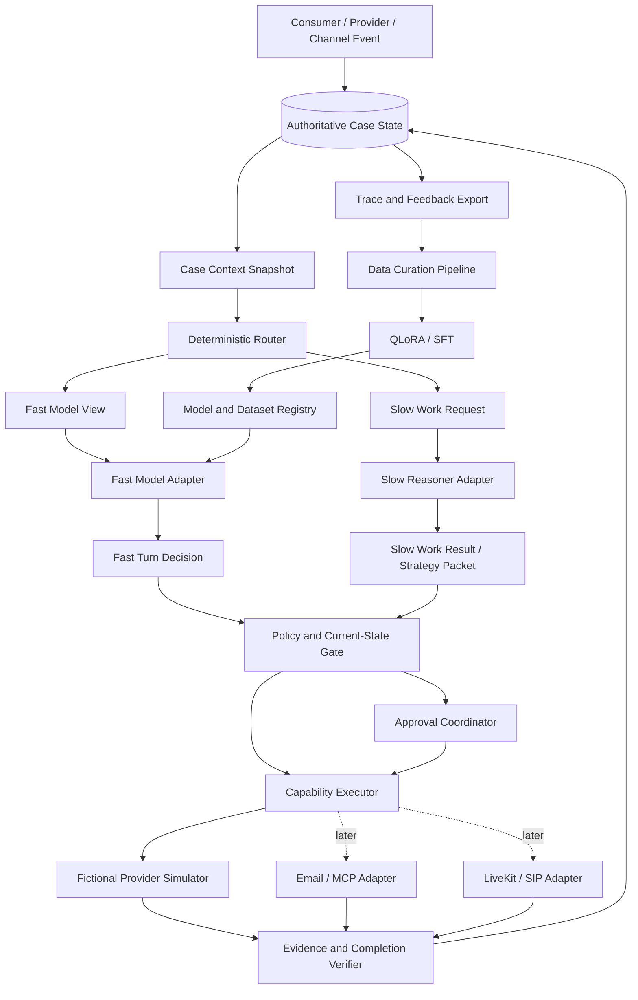

# Architecture Overview

## Purpose

The system represents a consumer in a narrowly scoped telecom bill-optimization case. It collects the consumer's goals and constraints, plans a negotiation, conducts low-latency dialogue against a provider, records evidence, requests approval for consequential actions, and continues until the case reaches a verifiable terminal state.

The architecture must serve two related but separate concerns:

1. A reproducible ML system for data generation, post-training, evaluation, serving, and failure-driven retraining.
2. A durable agent product that can later wait across days, receive external events, use controlled channels, and recover without duplicating side effects.

The system is a portfolio-grade prototype until it has completed a real, reviewed pilot. It is not described as a production Pine clone.

## High-Level Shape



The diagram is a target shape, not an inventory of implemented services. Repository status is:

- **Implemented**: canonical contracts, the fictional Provider simulator, deterministic `agent_core` routing and policy boundaries, a transport-neutral Case application Runtime, a local FastAPI Case adapter with direct memory mode by default, one opt-in PostgreSQL aggregate adapter, one explicitly configured OpenAI-compatible Fast/Slow adapter for direct mode, and one explicit scripted/PostgreSQL Temporal CaseWorkflow mode.
- **Research-only, not product-runtime serving**: the Phase 02 Data Factory pilot and Phase 03A1 evaluation/baseline runners and artifacts.
- **Implemented bounded local slice**: `apps/web` keeps conversation as the primary workspace and calls the existing local FastAPI Thin Runtime through one Next rewrite and one narrow runtime client. It renders Runtime-derived Case facts, one offer, exact approval pins, and a receipt only after the completion Evidence predicate passes.
- **Target/deferred**: normalized production data models and migrations, real-effect outbox/reconciliation, external connectors, voice, promoted-model serving, authentication, channels, production UI, deployment, and release remain separately gated. This local slice does not make a production Pine clone claim.

The current research runtime uses an in-memory Case repository in default direct mode and may explicitly opt into a synchronous PostgreSQL adapter that stores one strict, versioned JSONB aggregate with revision compare-and-swap. A separate explicit Temporal mode requires scripted decisions and PostgreSQL; it durably orders commands, waits, timers, retries, worker recovery, and Continue-As-New while PostgreSQL remains the only business truth. The slice still bypasses Gmail, MCP, and LiveKit. Its idempotency and recovery claims apply only to the deterministic fictional Provider; it does not claim exactly-once real external effects. Configuration never falls back automatically.

## Architectural Layers

### Experience Layer

- `apps/web`: bounded Next.js conversation-first interface for the fictional telecom Case. It keeps Task Brief, Progress, Offer, Approval, and Evidence receipt artifacts inline in one conversation. Its versioned browser envelope stores only the Runtime Case locator, confirmed intake facts, and one exact pending command for uncertain retry; PostgreSQL remains authoritative.
- `apps/web/next.config.ts` rewrites `/api/runtime/:path*` to the local FastAPI service at `127.0.0.1:8000`; `apps/web/lib/runtime-client.ts` is the only Web-to-Runtime seam.
- The UI never communicates directly with model providers, Gmail, SIP carriers, or Provider internals. It does not infer success from assistant text: approval pins and completion Evidence come from the Runtime response.

### Control Plane

- Current `runtime/services/api`: FastAPI endpoints, readiness, and operation observation. It directly invokes the shared Case Runtime by default and dispatches POST commands through Temporal only in explicit Temporal mode; GET remains a PostgreSQL projection.
- Current endpoints validate request and domain input against versioned contracts before applying local state transitions.
- In the target system, this layer becomes the authentication and webhook boundary and delegates long-running model or channel work outside HTTP requests.

### Durable Orchestration

- Current bounded `runtime/services/workflow_worker`: one scripted fictional-Provider `CaseWorkflow`, PostgreSQL activity adapter, Update-with-Start client, readiness, and worker entry point.
- Workflow responsibility in this slice: command ordering, approval wait/expiry timer, bounded retry, worker recovery, and Continue-As-New control state.
- Activity responsibility in this slice: invoke the shared application Runtime against PostgreSQL and the deterministic fictional Provider. Real model, email, provider, and telephony activities remain deferred.
- Temporal history is not the authoritative business database.

### Agent Intelligence

- Current `runtime/packages/agent_core`: model-decision coordination, Case-context projections, deterministic Router, Safe Observation Adapter, policy and capability gates, strategy validation, stale-result handling, fact-update validation, and completion-candidate validation.
- Current `runtime/packages/openai_adapter`: one concrete OpenAI-compatible Structured Outputs implementation of the existing typed Fast and Slow protocols. It compiles semantic model output against trusted pins and remains proposal-only; it is not a provider registry or generic gateway.
- Current `runtime/packages/case_runtime`: owns the complete transport-neutral application loop, repository interfaces/adapters, command receipts, expiry transition, and current-result projection used by both API and Temporal activity. API compatibility modules re-export the prior imports.
- A later deployment may extract model serving behind a process boundary, but it must preserve the same typed protocols. No model SDK or serving process owns workflow durability, authorization, side effects, Evidence, or business state.

### Provider and Channel Layer

- `runtime/packages/provider_simulator`: fictional telecom provider, plan catalog, account/bill state, retention policy, provider personas, and deterministic mutations.
- `runtime/packages/connectors`: email and other asynchronous channel adapters added after the ML MVP.
- `voice/worker`: LiveKit agent and SIP integration added only after text-policy gates pass.
- Channel adapters translate events; they do not decide negotiation strategy or case completion.

### ML and Data Layer

- `ml/data_pipeline`: ingestion, normalization, synthetic rollout generation, quality filters, lineage, leakage detection, and split manifests.
- Target `ml/training`: base-model experiments, QLoRA/SFT, loss configuration, checkpoints, and reproducibility metadata. Training has not started.
- `ml/evaluation`: policy-field, end-to-end, safety, cost, latency, and statistical evaluation.
- Target `ml/serving`: vLLM deployment configuration for a promoted Linux/CUDA path. Apple-local inference remains a development path behind the typed Fast protocol.
- Large datasets, audio, and checkpoints live in object storage; Git stores schemas, manifests, small fixtures, and reports.

Phase 02 implements the first narrow Data Factory seam as a separate CPU-only `ml/` project. It consumes Phase 01B Safe Observation and Provider-environment interfaces through local path dependencies, exports only small drift-checked metadata artifacts, and cannot be imported by runtime packages or services. Its initial 128-record one-turn scripted pilot validates reproducibility and curation gates; it is explicitly not a training-ready corpus or a learned-model result.

## Model Responsibilities

### Slow Reasoner

The initial Slow Reasoner is a hosted frontier model called through a provider-neutral adapter with structured outputs. Its exact provider/model remains an implementation default subject to measured cost and quality gates. A deterministic Router requests Slow work at Case initialization and on material goal, constraint, authority, offer, Evidence, strategy-validity, stalled-dialogue, high-risk, or completion events.

Slow receives a version-pinned `SlowWorkRequest` derived from a `SlowReasonerView`. It may reason over a broader safe Case snapshot, relevant visible-event history or deterministic summary, domain policy, and the current simulator capability manifest.

It returns a `StrategyPacket` containing:

- `strategy_id`, `version`, `created_at`, and `expires_at`;
- `case_version` and `fact_ledger_version`;
- primary objective and current subgoal;
- hard constraints and ranked preferences;
- allowed and approval-required disclosure fields;
- concession ladder and fallback outcomes;
- required completion evidence;
- escalation and replan conditions.

Raw chain-of-thought is neither requested nor persisted.

Slow may also return bounded clarification, escalation, capability, or Action Intent proposals in a `SlowWorkResult`. It never executes tools, channels, or side effects. Deterministic modules reject stale results and authorize or execute current proposals.

### Fast Response Model

The Fast Response Model is the only model the project intends to train; training has not started. The initial checkpoint is `Qwen/Qwen3-4B-Instruct-2507`, used in its native non-thinking mode. It receives a safe, bounded view:

- consumer brief;
- current valid `StrategyPacket`;
- verified fact ledger snapshot;
- recent provider-visible conversation;
- latest provider message;
- pending Slow-work status;
- allowed dialogue acts and disclosure policy.

It returns a `FastTurnDecision`:

```json
{
  "dialogue_act": "clarify|counter|confirm|challenge|escalate|close",
  "fact_updates": [
    {
      "key": "monthly_price",
      "value": 79,
      "source_message_id": "m_123",
      "confidence": 0.99,
      "status": "candidate"
    }
  ],
  "reasoner_request": {
    "needed": false,
    "reason_code": "none"
  },
  "completion_claim": {
    "status": "not_done|candidate",
    "evidence_message_ids": []
  },
  "response_text": "..."
}
```

The Fast Model cannot:

- read provider-internal policy, database state, reference actions, or evaluation criteria;
- mark a fact as externally verified without evidence;
- declare final completion;
- accept a contract, disclose protected information, send email, or place a call directly;
- hold channel credentials.

For Phase 03A1, the existing optional `FastTurnDecision.action_intent` field remains wire-compatible but must be `null` in Fast requests and accepted outputs. Fast-originated side-effect proposals require a later explicit contract and evaluation gate.

### Model Collaboration and Routing

Fast and Slow share model-external Case state, not model memory. A `CaseContextSnapshot` is an immutable, version-pinned projection of authoritative state at one event cursor. Separate allowlisted Fast and Slow views are derived from it; neither view contains hidden chain-of-thought, KV cache, raw prompt dumps, Provider-private state, reference actions, rewards, evaluator criteria, or gold outcomes.

The Router produces one deterministic, reason-coded result for the current snapshot and event:

- `terminal`;
- `verify_only`;
- `wait_for_approval`;
- `slow_refresh`;
- `fast_now_and_slow_refresh`;
- `fast_now`.

The outcomes are mutually exclusive and the list above is their precedence order. The Router selects the first matching condition: `terminal` for an already verified terminal Case; `verify_only` for new Evidence or a completion candidate; `wait_for_approval` for a blocking current Approval Request; `slow_refresh` for mandatory Slow work without a safe acknowledgement; `fast_now_and_slow_refresh` for mandatory Slow work plus an explicitly permitted non-consequential acknowledgement; and `fast_now` for an ordinary turn under a current compatible strategy. Deterministic handlers append a new event before rerouting; they do not create a second outcome in the same decision.

Fast `reasoner_request` is an advisory signal. It cannot bypass mandatory Slow triggers or force an unsupported route. Fast may respond only within the current valid Strategy Packet. The concurrent route is limited to acknowledgements, clarification, or status communication that cannot state material terms, accept an offer, or trigger a side effect while Slow refreshes; consequential statements wait for a current strategy.

A planning-basis fingerprint binds the Strategy Packet to material goal, constraint, authority, verified-fact, offer, approval, Provider-configuration, and capability-manifest state. Non-material conversation may advance the event cursor without invalidating strategy. Every model output echoes its input pins; stale Fast or Slow output is traced and rejected without delivery, merge, or state mutation, then rerouted against the latest snapshot.

The complete decision and evidence boundary is frozen in `docs/decisions/2026-08-23-fast-slow-orchestration.md`.

`CapabilityManifest` is the sole model-facing vocabulary for executable actions. Approval state, executor dispatch, adapter configuration, and Evidence rules remain deterministic internal mechanisms rather than model "skills." The current runtime has one simulator capability family, so it does not introduce a parallel skills registry or a speculative internal capability catalog.

## Core Domain Contracts

The canonical contract layer defines these Pydantic contracts before service code:

- `Case`: lifecycle identity, owner, phase, version, and timestamps.
- `ConsumerGoal`: desired outcome, budget, service requirements, and deadline.
- `Constraint`: hard/soft classification, source, version, and validity.
- `BillSnapshot`: current price, line items, add-ons, term, usage, and evidence source.
- `FactLedger`: append-only candidate/verified/rejected facts with provenance.
- `StrategyPacket`: Slow Reasoner output described above.
- `FastTurnDecision`: Fast Model output described above.
- `ProviderOffer`: monthly price, total cost, features, fees, term, expiry, and provider evidence.
- `ActionIntent`: proposed external or simulator action.
- `ApprovalRequest`: exact action/offer version and expiry that the user approves or rejects.
- `Evidence`: message, provider event, confirmation ID, bill, or simulator state transition.
- `CompletionDecision`: deterministic verifier result and missing evidence.
- `ModelTrace`: model/data/prompt versions, latency, token usage, result, and safety flags.

Phase 03A1 implemented and generated the canonical wire contracts for `CaseContextSnapshot`, Fast/Slow Model Views, `RoutingDecision`, `SlowWorkRequest`, `SlowWorkResult`, planning-basis pins, and `CapabilityManifest`. Their architecture was frozen in Phase 03A0 and is now enforced by contract-generation and drift checks.

All mutable objects use optimistic versions. An approval is valid only for the exact case, strategy, constraint set, and offer version it references.

## State Ownership

| State | Authoritative owner | Notes |
|---|---|---|
| Cases, constraints, offers, approvals, evidence, command receipts, fact ledger, event log, context projection | Local memory store in default direct mode; PostgreSQL versioned aggregate in explicit Temporal mode | Business source of truth and audit surface. Temporal carries only compact transition references. Production normalization, migrations, and outbox remain deferred. |
| Timers, retries, waits, workflow phase | Temporal | Stores IDs and control state, not a second business database. |
| Provider simulator episode | Simulator store | Resettable and versioned per benchmark episode. |
| Raw/curated datasets, audio, checkpoints | Object storage | Addressed by immutable manifest and content hash. |
| Experiment runs and promoted model metadata | MLflow OSS | SQLite/local artifacts for the first experiments; database-backed registry and S3-compatible artifacts for integrated deployment. |
| Prompt context | Ephemeral model request | Reconstructed from approved business state; never authoritative. |

## Agent Decision Loop

This contract-level flow is the agent architecture; it is not a chain of autonomous Planner, Thinker, and Verifier agents. Its bounded loop is:

`Observe -> Route -> Propose (Fast dialogue / Slow strategy) -> Validate -> Policy / Approval -> Execute -> Evidence -> Verify -> Complete / Wait / Replan`

Phase 04A currently demonstrates the fixed simulator offer path: it installs the initial validated Slow strategy, returns Fast decisions, and deterministically derives the one accept-offer intent from current compliant Case state. Later phases must separately gate broader fact merging, action proposals, durable work, and real adapters.

1. A Consumer, Provider, simulator, approval, or executor event is appended to the Case event log.
2. The coordinator projects an immutable `CaseContextSnapshot` with business revisions, event cursor, planning basis, pending work, and capability-manifest version.
3. The deterministic Router chooses Fast, Slow, concurrent bounded work, approval wait, verification, or terminal handling and records reason codes.
4. Fast and/or Slow adapters receive separate allowlisted views and return version-pinned proposals.
5. Current-state validation rejects schema-invalid, forbidden, unauthorized, planning-basis-incompatible, or stale output without patching it.
6. Accepted Slow strategy/work updates and Fast candidate facts enter the serialized Case write lane.
7. The policy gate and approval coordinator transform current permitted proposals into inert Action Intents.
8. The capability executor revalidates strategy, authority, approval, expiry, capability, and idempotency immediately before invoking the fictional simulator or a later controlled adapter.
9. Results are captured as immutable Evidence and cause a new snapshot and route.
10. The verifier decides `continue`, `needs_user`, `needs_replan`, `candidate_complete`, or `complete`; completion requires current material terms and sufficient external Evidence.

## Data and Training Flow

1. Freeze scenario families, entity clusters, provider policy branches, and headline test manifests before teacher generation.
2. Ingest only sources with recorded provenance and license status.
3. Normalize records into a versioned trajectory schema.
4. Implement the multi-turn evaluation coordinator, simulator-only capability manifest, and frozen held-out test manifests before model calls.
5. Measure untuned Fast with Slow disabled/enabled, plus scripted-oracle and frontier-reference baselines.
6. Audit and normalize non-overlapping licensed public data only after the baseline failure slices exist.
7. Run an open-data-only SFT experiment when the untuned baseline leaves learnable Fast-policy gaps.
8. Generate project-specific trajectories only for remaining measured gaps and execute every trajectory in the simulator.
9. Filter with deterministic state checks, safety rules, schema validation, and random human review; quarantine rejected samples with reason codes.
10. Train only the bounded Fast fields plus response text, with loss masking/weighting measured explicitly.
11. Evaluate on family/entity/provider-held-out cases, multiple seeds, paired Fast/Slow baselines, and unchanged safety gates.
12. Promote a model only after policy, safety, serving, and regression gates pass.

Phase 02 validated only ingestion, normalization, curation, and export plumbing through a one-turn scripted pilot. Its deterministic scripted consumer substituted for a paid teacher to verify the Data Factory interface and recorded zero external token cost; it did not call a model, establish training readiness, or implement the multi-turn evaluation and training stages above.

## Safety and Reliability Invariants

- External text and speech are untrusted inputs and may contain prompt injection.
- Model output never bypasses deterministic authorization and disclosure gates.
- Model output with stale context or planning-basis pins is never delivered, merged, or executed.
- The capability manifest is the sole advertised action vocabulary; unavailable MCP/channel capabilities cannot appear in accepted model work.
- Real side-effecting activities require an outbox record, provider event ID when available, and an idempotency key; that mechanism remains deferred.
- Phase 05A Temporal retries use PostgreSQL command receipts to avoid duplicate fictional-Provider execution, approvals, and Evidence. No equivalent real-effect exactly-once claim is made.
- A stale strategy or approval cannot authorize a changed offer.
- Fast Model completion is always a candidate; the external verifier has final authority.
- Production feedback enters a quarantine/review queue and never flows directly into training.
- PII is excluded from training data unless a separately documented consent and retention policy permits it.
- Every trace links `case -> prompt/model -> evidence -> dataset derivation -> model version` where applicable.

## Observability

Every model/channel/workflow span should carry:

- `case_id`, `workflow_id`, and `episode_id`;
- case/strategy/fact-ledger versions;
- model, adapter, prompt, dataset, and simulator versions;
- latency segments, token usage, and estimated cost;
- policy-gate result and reason code;
- provider/channel result and idempotency key;
- verifier outcome and safety flags.

Dashboards should separate model quality from infrastructure reliability:

- task/constraint success and false completion;
- fact precision/recall and unsupported verified facts;
- Slow call rate and value added;
- latency/cost per successful case;
- workflow retries, duplicate-side-effect prevention, and stuck cases;
- provider refusal, transfer, and channel failure rates.

## Deployment Shape

### Research MVP

- Local/CI simulator process with memory storage by default and optional PostgreSQL Case aggregate persistence;
- deterministic Router, context projector, and serialized Case write/execution lane;
- Fast and Slow interfaces with local deterministic adapters and optional measured model adapters;
- simulator-only capability manifest;
- optional remote GPU Fast inference;
- object storage or local artifact directory;
- experiment tracker;
- no Temporal, Gmail, or telephony.

### Integrated Portfolio Demo

- Next.js web app;
- FastAPI control plane;
- PostgreSQL;
- Temporal server and Python worker;
- Fast Model inference endpoint;
- hosted Slow Reasoner;
- Gmail draft/controlled test mailbox;
- optional LiveKit worker and owned test number;
- OpenTelemetry-compatible traces and metrics.

## Extension Points

- New providers implement a versioned provider-policy and plan-catalog adapter.
- New tool or channel adapters enter only through a versioned Capability Manifest and the existing policy/approval/executor path.
- New product domains implement domain contracts, simulator transitions, completion verifier, and benchmark families without changing workflow fundamentals.
- A future Agentic RL stage consumes verified simulator rewards only after SFT and evaluation stability; it is not part of the initial architecture claim.
